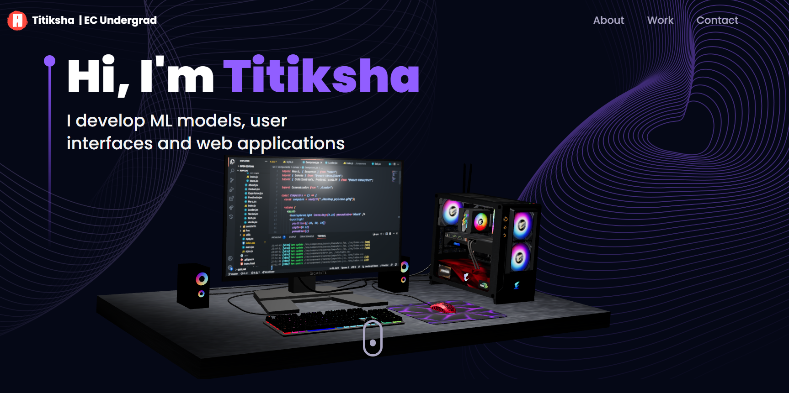
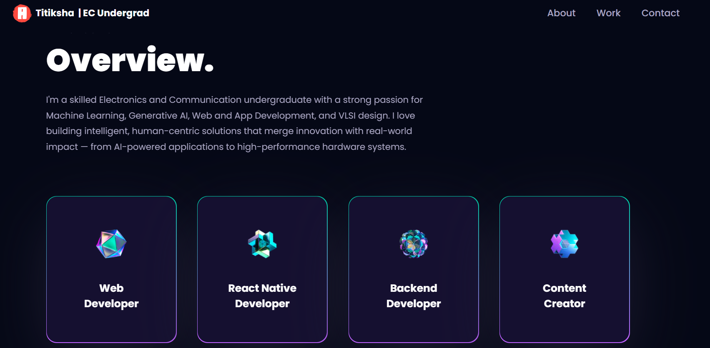
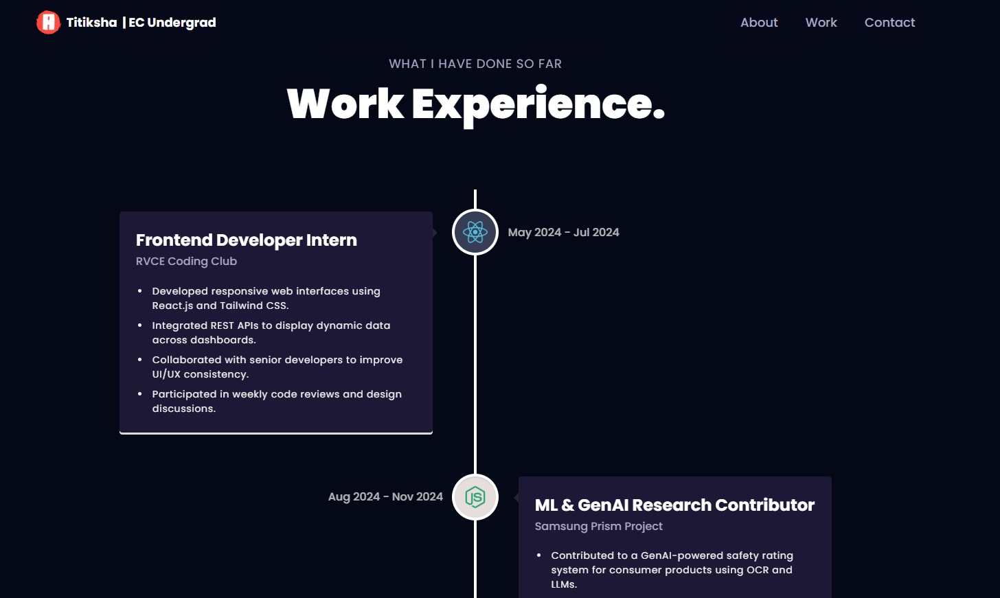
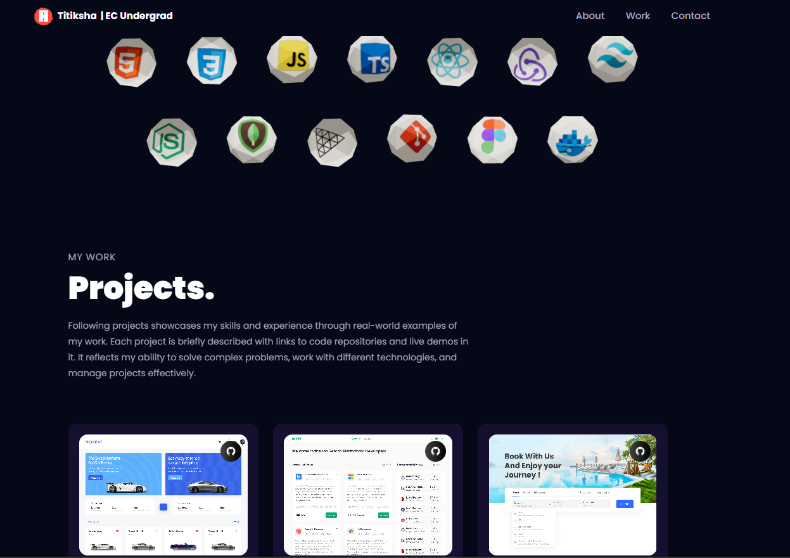
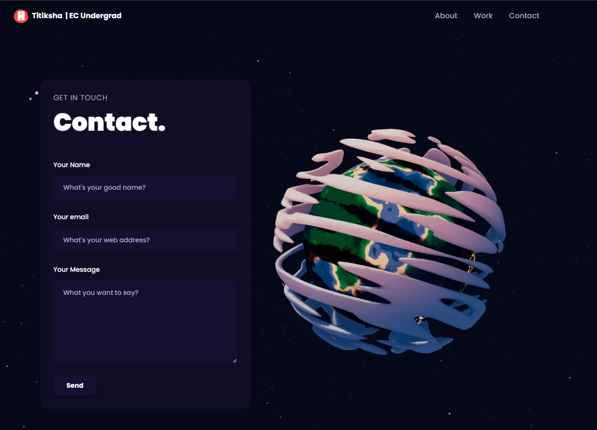

# 🌐 Titiksha's 3D Developer Portfolio

Welcome to my interactive 3D developer portfolio — designed to reflect creativity, technology, and my passion for impactful engineering.

This website showcases my journey as an Electronics and Communication undergraduate exploring the exciting worlds of:

🧠 Machine Learning | ⚙️ VLSI | 💡 Generative AI | 🌍 Web & App Development

---

## 🚀 Features

✨ 3D Hero Section with Scroll Animations  
🛠️ Interactive Tech Stack Showcase  
🧭 Smooth Navigation & Animations  
📂 Projects, Work Experience, Testimonials  
📱 Fully Responsive Design  
🌙 Dark-Themed Aesthetics (Tailwind + Three.js)

---

## 🧰 Tech Stack

| Category         | Tools Used                                      |
|------------------|--------------------------------------------------|
| 💻 Frontend      | React.js, Tailwind CSS, Vite                     |
| 🎮 3D Graphics    | Three.js, React Three Fiber, @react-three/drei  |
| 🔄 Animations     | Framer Motion                                    |
| 📦 State Mgmt     | React Hooks, Context API                         |
| 🎨 Design Tools   | Figma (for UI prototyping)                       |
| 🌐 Deployment     | Vercel                                           |

---

## 🖼️ Portfolio Screenshots

| Hero Section | Tech Stack |
|--------------|------------|
|  |  |

| Projects Page | About Me |
|----------------|----------|
|  |  |

| Contact / Footer |
|------------------|
|  |

---

## 🧑‍💻 Want to Collaborate?

If you're building something cool with AI, Web, or VLSI — or just want to chat tech — feel free to reach out!
---
*Crafted with ❤️ by Titiksha*
